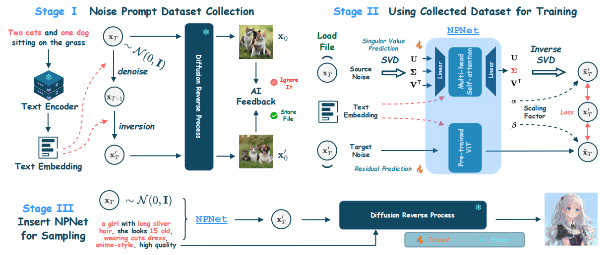

# Update:
NPNet的训练流程主要分为三个部分: StageI(Noise Prompt Dataset Collection)、StageII(Using Collected Dataset for Training)、StageIII(Insert NPNet for Sampling)

1. StageI: 第一阶段的目标是获取大规模的Noise Prompt Dataset(NPD)。首先对原始的随机高斯噪声x_T进行去噪, 得到x_{T-1}, 然后使用DDIM-Inversion得到更加具有语义信息的x_T'。X_T和X_T'执行去噪过程, 得到x_0和x_0', 通过人类偏好模型进行过滤, 得到符合条件的数据对(原始噪声-prompt-优化后的噪声)。

2. StageII: 收集完NPD后, 将原始的噪声, 优化后的噪声以及文本提示放入NPNet中, 其中噪声由奇异值预测器和残差预测器处理, 文本提示由T2I扩散模型的文本编码器编码, 来进行噪声的预测。

3. StageIII: 经过训练, NPNet可以在模型的推理过程中, 在给定随机初始噪声以及prompt的前提下, 将随机初始噪声转化为黄金噪声, 提升了模型的推理效果。



# Golden Noise for Diffusion Models: A Learning Framework

<div align="center">
      
[](https://arxiv.org/abs/2411.09502)
[](https://huggingface.co/Klayand/GoldenNoiseModel)


</div>

## NPNet Pipeline Usage Guide😄 

### Overview

This guide provides instructions on how to use the NPNet, a noise prompt network aims to transform the random Gaussian noise into golden noise, by adding a small desirable perturbation derived from the text prompt to boost the overall quality and semantic faithfulness of the synthesized images.

Here we provide the inference code which supports different models like ***Stable Diffusion XL, DreamShaper-xl-v2-turbo, and Hunyuan-DiT.***. 

Besides, you can apply the checkpoint of NPNet on SDXL to the models like ***SDXL-Lightning, LCM, DMD, DMDv2 and PCM***. The visualizations of these three models are shown below:


### We will quickly release the NPNet checkpoint of Pixelart-Sigma, SD3, SD3.5 and FLUX !!! 😄 😄 😄 

### Requirements

- `python >= 3.8.0`
- `pytorch with cuda version`
- `diffusers`
- `PIL`
- `numpy`
- `timm`
- `argparse`
- `einops`

### Installation🚀️

Make sure you have successfully built `python` environment and installed `pytorch` with cuda version. Before running the script, ensure you have all the required packages installed. You can install them using:

```bash
pip install diffusers, PIL, numpy, timm, argparse, einops
```

### Usage👀️ 

To use the NPNet pipeline, you need to run the `npnet_pipeline.py` script with appropriate command-line arguments. Below are the available options:

#### Command-Line Arguments

- `--pipeline`: Select the model pipeline (`SDXL`, `DreamShaper`, `DiT`). Default is `SDXL`.
- `--prompt`: The textual prompt based on which the image will be generated. Default is "A banana on the left of an apple."
- `--inference-step`: Number of inference steps for the diffusion process. Default is 50.
- `--cfg`: Classifier-free guidance scale. Default is 5.5.
- `--pretrained-path`: Path to the pretrained model weights. Default is a specified path in the script.
- `--size`: The size (height and width) of the generated image. Default is 1024.

#### Running the Script

Run the script from the command line by navigating to the directory containing `npnet_pipeline.py` and executing:

```
python npnet_pipeline.py --pipeline SDXL --prompt "A banana on the left of an apple." --size 1024
```

This command will generate an image based on the prompt "A banana on the left of an apple." using the Stable Diffusion XL model with an image size of 1024x1024 pixels.

#### Output🎉️ 

The script will save two images:

- A standard image generated by the diffusion model.
- A golden image generated by the diffusion model with the NPNet.

Both images will be saved in the current directory with names based on the model and prompt.

### Pre-trained Weights Download❤️

We provide the pre-trained NPNet weights of Stable Diffusion XL, DreamShaper-xl-v2-turbo, and Hunyuan-DiT with [google drive](https://drive.google.com/drive/folders/1Z0wg4HADhpgrztyT3eWijPbJJN5Y2jQt?usp=drive_link)

### Citation:
If you find our code useful for your research, please cite our paper.

```
@misc{zhou2024goldennoisediffusionmodels,
      title={Golden Noise for Diffusion Models: A Learning Framework}, 
      author={Zikai Zhou and Shitong Shao and Lichen Bai and Zhiqiang Xu and Bo Han and Zeke Xie},
      year={2024},
      eprint={2411.09502},
      archivePrefix={arXiv},
      primaryClass={cs.LG},
      url={https://arxiv.org/abs/2411.09502}, 
}
```

### 🙏 Acknowledgements

We thank the community and contributors for their invaluable support in developing NPNet. 
We thank @DataCTE for constructing the ComfyUI of NPNet inference code [ComfyUI](https://github.com/DataCTE/ComfyUI_Golden-Noise).
We thank @asagi4 for constructing the ComfyUI of NPNet inference code [ComfyUI](https://github.com/asagi4/ComfyUI-NPNet).

---


